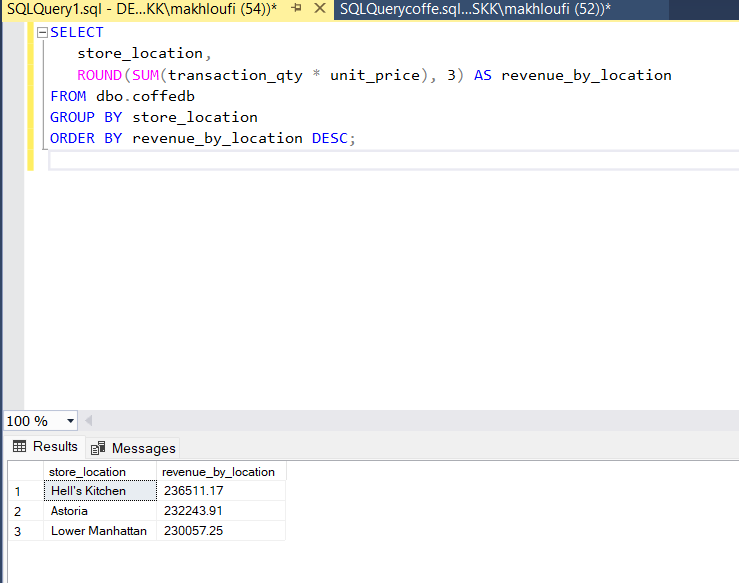
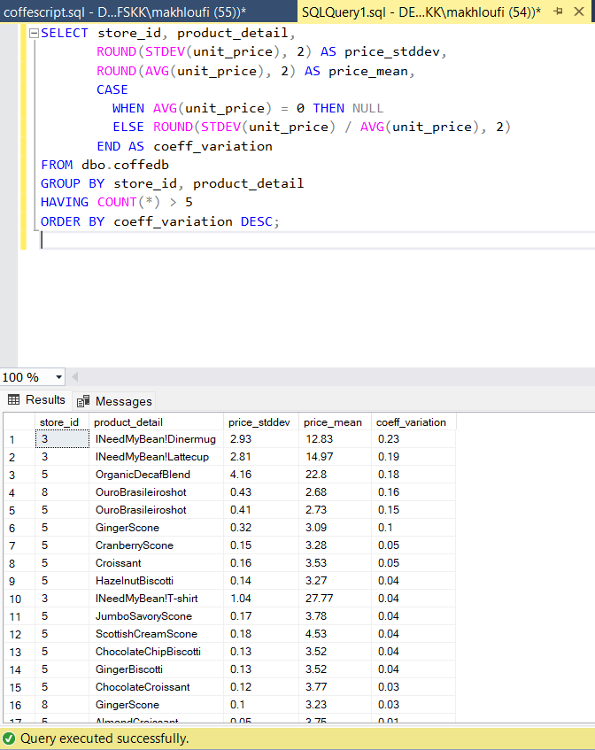
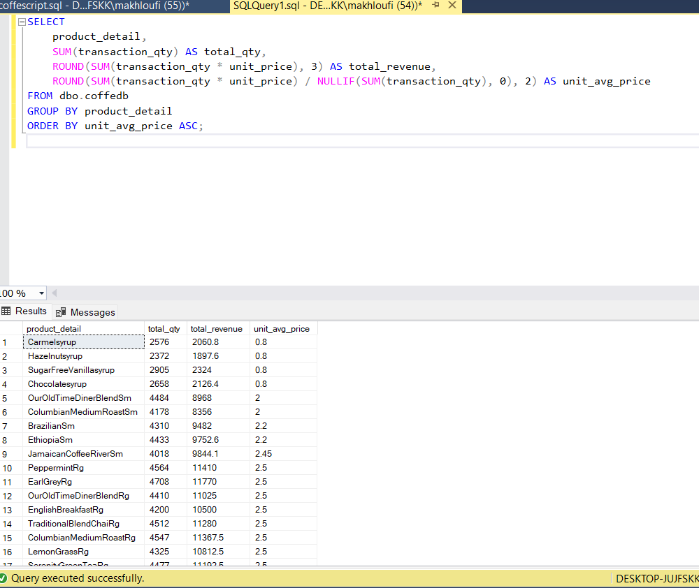

# Produktkategorien
**Zusammenfassung der Beobachtungen:**
Deutliche Dominanz von Kaffee: Mit fast 90 000 Einheiten macht Kaffee rund 40 % des Umsatzes aus – das bestätigt das Kerngeschäft.
  Tee folgt auf Platz 2 mit einem hohen, aber geringeren Verkaufsvolumen.
  Bakery, Drinking Chocolate und Flavours weisen mit etwa 23 000, 17 000 bzw. 10 000 verkauften Einheiten deutlich geringere Werte auf.
    Das zeigt, dass das Geschäft vor allem auf klassische Heißgetränke (Kaffee, Tee) ausgerichtet ist.
    Diese Erkenntnisse unterstützen gezielte Marketing- und Beschaffungsentscheidungen (insb. Kaffee- und Teebestände).
    
 

# Umsatz nach Standort

**Zusammenfassung der Beobachtungen:**

    Der Gesamtumsatz ist zwischen allen drei Standorten sehr ausgeglichen (> 230 000 €).

    Hell’s Kitchen liegt knapp vor Astoria und Lower Manhattan – vermutlich wegen besserem Fußgängeraufkommen, touristischer Lage oder stärkerer morgendlicher Frequenz.

    Astoria und Lower Manhattan liegen dicht dahinter – kein Standort zeigt Schwäche.

    Das deutet auf eine ausgewogene regionale Umsatzverteilung hin.
    Revenuparlocalisation

# Preisvariabilität nach Produkt und Standort

**Zusammenfassung der Beobachtungen:**

    Merchandising-Artikel wie INeedMyBean! Dinermug und Lattecup zeigen hohe Preisvariabilität (Koeffizient > 0,15), möglicherweise wegen Promoaktionen, Produktversionen oder Eingabefehlern.

    Die meisten Lebensmittelprodukte weisen geringe Schwankungen auf – hohe Preisstabilität.

    Produkte wie OrganicDecafBlend zeigen hingegen erhöhte Preisvariabilität – weiterer Beobachtungsbedarf.

# Verkaufsdauer der Produkte

**Zusammenfassung der Beobachtungen:**

    Die meisten Produkte sind bis zum 30. Juni aktiv – das Sortiment wurde in letzter Zeit nicht stark verändert.

    Einige Produkte (z. B. INeedMyBean!Dinermug) wurden in den letzten Tagen nicht mehr verkauft – möglicherweise ruhend oder auslaufend.

# Analyse ABC (Pareto 80/20) – Umsatzanteil der Produkte

**Zusammenfassung der Beobachtungen:**

    Hoher Umsatzfokus: ca. 35 Produkte erzielen 80 % des Umsatzes.

    Die „A“-Produkte sind die Top-Verkaufsschlager mit hoher Rotation.

    Die „B“- und „C“-Produkte:

        Entweder als Nischenprodukte wertvoll (Kundenbindung).

        Oder Kandidaten zur Rationalisierung bei geringer Marge/Vk-Zahl.
        Analyse%20ABC%20

# Umsatz‑Gewichts‑Verhältnis pro Produkt

**Zusammenfassung der Beobachtungen:**

    Sirupe (Caramel, Hazelnut, Vanilla, Chocolate) haben niedrige Einzelpreise (~0,80 $) – typische Zusatzartikel.

    Kleine Kaffeegrößen (Sm, Rg) erzielen 2–3 $ pro Stück.

    Gebäckartikel (Scones, Biscuits) liegen bei 3–4,5 $.

    Premiumprodukte (SustainablyGrownOrganic, DarkchocolateLg) erzielen höhere Einzelpreise (4,5–7,6 $).

    Premium-Artikel wie INeedMyBean! Tassen oder ChiliMayan liegen bei 12–14 $ – Merchartikel.

# Tägliches Verkaufsvolumen

**Zusammenfassung der Beobachtungen:**

    Starker Anstieg des Volumens zwischen Januar (~550–600) und Juni (~1000–1100).

    Tagesbezogene Schwankungen, aber insgesamt steigender Trend – gesundes Wachstum.

    Zuwachs kann saisonal, marktorientiert oder durch Kampagnen bedingt sein.

# Top-3-Produkte

**Zusammenfassung der Beobachtungen:**

    Die drei meistverkauften Produkte machen weniger als 7 % des Gesamtverkaufs aus – breite Long-Tail-Verteilung.

    Kein dominierender Bestseller → interessante Nischenprodukte zur gezielten Förderung (Promotion/Combos).

    Wichtigkeit eines großen Sortiments, da Umsatz breit gestreut ist.
    Top%203%20produits

# Umsatz nach Tageszeit

**Zusammenfassung der Beobachtungen:**

    Verkaufsmaxima zwischen 8–10 Uhr morgens – klassische Kaffeekonsumenten-Zeit.

    7 Uhr als Umsatztreiber (+40 k mehr als um 6 Uhr) – starke Aktivitätsphase.

    Ab 18 Uhr stark fallende Umsätze, nach 20 Uhr kaum noch Aktivität.

    ➜ Strategische Empfehlung: Morgens früher öffnen, keine Verlängerung spätabends.

# Produktdetails

**Zusammenfassung der Beobachtungen:**

    Hochwertige Kaffee- und Teesorten wie SustainablyGrownOrganicLg und DarkchocolateLg erzielen ~21 k Umsatz.

    Breite Produktpalette (Cappuccino, Latte, Chai, Scones, Croissants, Biscuits).

    Originalrezepte (MorningSunriseChaiLg) fast so umsatzstark wie Klassiker.

    Auch Standardprodukte wie LatteRg erzielen konstant hohe Umsätze.

# Transaktionen außerhalb typischer Zeiten

**Zusammenfassung der Beobachtungen:**

    7 Uhr als Umsatztreiber gegenüber 6 Uhr (+40 k) – starker Start in den Tag.

    Kontinuierlicher Verkaufsrückgang nach 10 Uhr, Umsatz bleibt bis 17 Uhr stabil.

    Ab 18 Uhr deutlicher Einbruch, ab 20 Uhr fast keine Aktivität mehr.
    Strategie:
    ➜ Fokus auf Frühorientierung: „before 10AM“-Promos oder frühzeitige Öffnungen.
    Detaillierte Beobachtungen:

    Nach 20 Uhr fast keine Transaktionen.

    Deutlicher Umsatzstart vor 8 Uhr, z. B. Lower Manhattan (Pendler), Astoria (ab 07:01).
    Fazit:

    Frühere Öffnung (6:30–7 Uhr) in Top-Standorten sinnvoll.

    Kein klarer Bedarf für späte Öffnungszeiten – Personal investieren in den Morgen.

