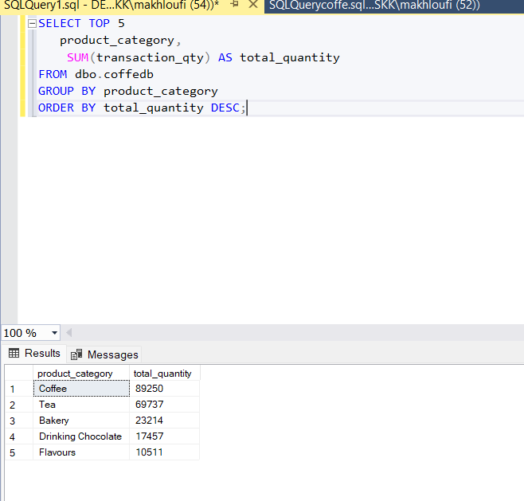
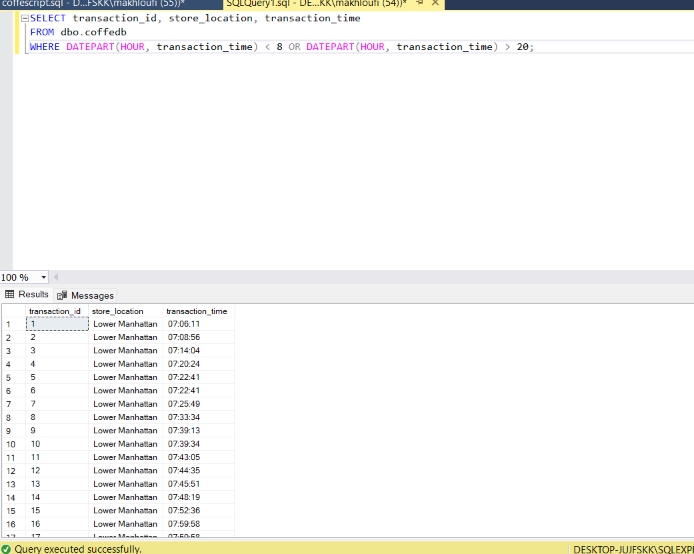

# Catégories de produits

**Résumé des observations :**
•Domination nette du café : avec près de 90k unités, le café représente près de 40% des ventes parmi ces 5 catégories. Cela confirme que le cœur du business repose sur cette catégorie.
• Tea suit en deuxième position, aussi avec un volume important mais inférieur au café.
• Bakery, Drinking Chocolate et Flavours ont des volumes bien plus faibles, avec respectivement environ 23k, 17k et 10k unités vendues. 
•Cela suggère que le coeur de l’activité commerciale tourne autour des boissons chaudes classiques (café, thé), tandis que les produits annexes ou complémentaires (pâtisseries, boissons chocolatées, arômes) ont un poids moindre.
•Cette info peut orienter des décisions marketing ou d’approvisionnement, par exemple en concentrant plus de stock sur le café et le thé. 

# Transactions en dehors des horaires typiques

**Résumé des observations :**

- 7h est un tremplin (+40k de plus qu’à 6h), signe que la boutique est déjà bien active à l'ouverture.  
- Les ventes diminuent graduellement après 10h, mais restent soutenues jusqu’à 17h, probablement en lien avec des pauses café ou snacks.  
- Chute forte après 18h, et quasi-nulle à 20h → très peu d’activité nocturne → possibilité de fermeture avant ou faible fréquentation en soirée.

**Idée stratégique :**  
Exploiter ce comportement avec des promotions matinales ou formules "before 10AM".
## Observations détaillées
- Aucune transaction après 20h n’apparaît.  
- Une forte activité avant 8h est visible dans plusieurs magasins.  
- Lower Manhattan semble avoir une clientèle matinale active (peut-être liée à des bureaux ou trajets pendulaires).  
- Astoria aussi montre des transactions dès 07:01.
## Conclusion

- Il pourrait être stratégique d’ouvrir dès 6h30–7h dans certains emplacements comme Lower Manhattan.  
- Inversement, pas besoin évident d’élargir l’horaire au-delà de 20h sauf données contraires.  
- Cela permettrait de réduire les coûts en personnel en fermant tôt et en renforçant la présence matinale.

