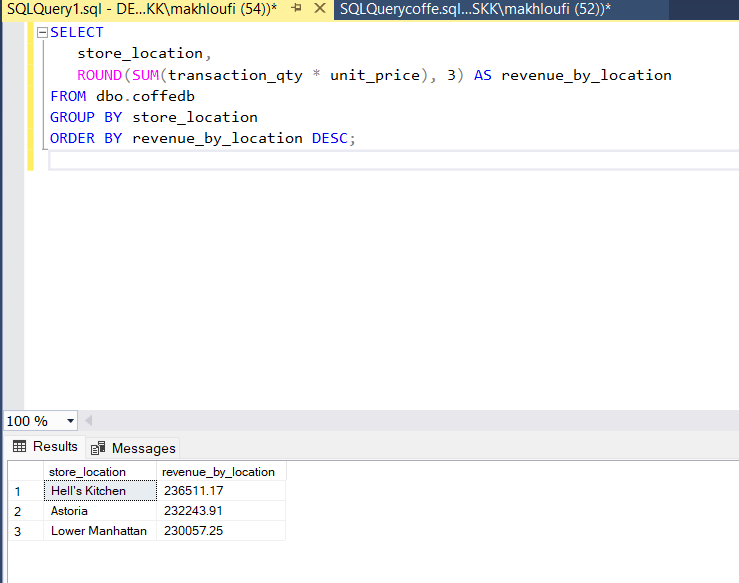
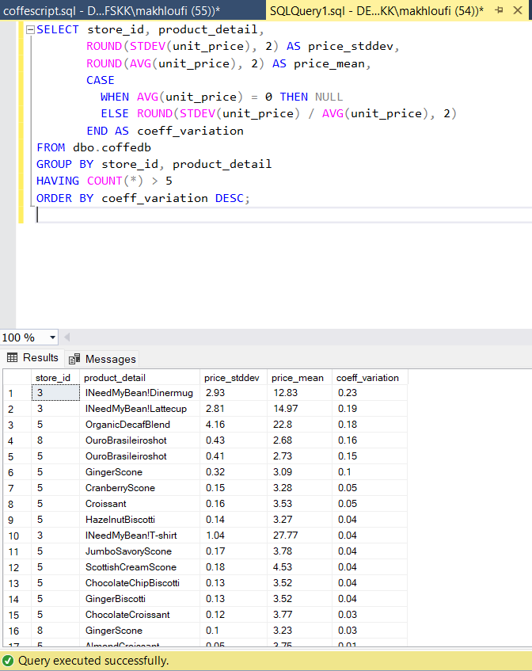

# Product Categories

**Summary of Observations:**
• Clear dominance of coffee: with nearly 90k units sold, coffee accounts for about 40% of total sales among these 5 categories. This confirms that the core of the business relies on this product.
• Tea ranks second, also with a significant volume but lower than coffee.
• Bakery, Drinking Chocolate, and Flavours have much lower volumes, with approximately 23k, 17k, and 10k units sold respectively.
• This suggests that the commercial activity mainly revolves around classic hot beverages (coffee, tea), while complementary or secondary products (pastries, chocolate drinks, flavorings) have a smaller role.
• This insight can help guide marketing or supply chain decisions — for instance, focusing more inventory on coffee and tea. 

 # Revenue by Location
**Summary of Observations:**
• This summary shows total revenue per store or geographic location.
• All three locations have very similar revenues, slightly above €230K.
• Hell's Kitchen leads, which may be explained by higher foot traffic, a more tourist-oriented clientele, or greater morning activity.
• Astoria and Lower Manhattan follow closely — no store is underperforming, which reflects strong overall brand performance.
• This indicates a balanced distribution of sales across the three zones.

 # Price Variability by Product and Store
**Summary of Observations:**
• Merchandising products like INeedMyBean! Dinermug and Lattecup show high variability (coefficient > 0.15), which could be explained by promotions, different versions, or data entry errors.
• Most food products have low standard deviation and near-zero coefficients, indicating stable pricing across transactions within the same store.
• Some products, like OrganicDecafBlend, show slightly higher variability and should be monitored.

# Product Availability Duration
**Summary of Observations:**
• The vast majority of products are still active up to June 30, indicating that the assortment hasn't changed recently.
• Some products (such as INeedMyBean! Dinermug) haven’t been sold in recent days → possibly dormant or end-of-cycle items.

# ABC Analysis (Pareto 80/20) – Product Contribution to Revenue
**Summary of Observations:**
• Strong revenue concentration: around 35 products generate 80% of total revenue.
• High-turnover star products: these are classified as "A" in the ABC classification.

The other products ("B" and "C"):
• May be niche items worth keeping for brand image or customer loyalty.
• Or potential candidates for rationalization — especially those with very low sales and low margins.

# Revenue-to-Quantity Ratio by Product
**Summary of Observations:**
• Syrups (Caramel, Hazelnut, Vanilla, Chocolate) have a very low unit price of around $0.80, likely used as ingredients or small add-ons.
• Small-size coffees (Sm, Rg) have unit prices around $2 to $3.
• Pastry items (Scones, Biscuits) are priced around $3 to $4.50.
• Organic or premium products (SustainablyGrownOrganic, DarkchocolateLg) show higher unit prices ($4.50 to $7.60).
• Some specific items such as "INeedMyBean!" mugs or "ChiliMayan" products have very high unit prices ($12 to $14), likely merchandising or specialty items.

# Daily Volume Series
**Summary of Observations:**
• A general upward trend is observed from January (around 550–600) to June (about 1000–1100), roughly doubling over the period.
• While daily fluctuations exist, the overall trend is positive — a sign of sustained growth.
• This increase could reflect natural demand growth, seasonal effects (more activity in spring/summer), or effective marketing campaigns.
• Volume appears stable with regular peaks, indicating a healthy business.

# Top 3 Products
**Summary of Observations:**
• The top 3 best-selling products represent less than 7% of total cumulative sales → indicating a very diverse product offering with a long tail distribution.
• No single product dominates sales: a long-tail strategy is in place → analyzing niche products could help unlock their full potential (via promotions or combo offers).
• This also highlights the importance of maintaining a broad catalog, as sales are well distributed across the product range.

# Revenue by Hour of the Day
**Summary of Observations:**
• The sales peak is between 8 AM and 10 AM — confirming typical coffee consumption behavior before or upon arriving at work.
• 7 AM acts as a ramp-up (+€40K more than at 6 AM), indicating the store is already quite active at opening.
• Sales gradually decline after 10 AM but remain steady until 5 PM, likely linked to coffee or snack breaks.
• Sharp drop after 6 PM, and almost zero by 8 PM → very little nighttime activity → possibility of early closing or low evening traffic.

# Product Details
**Summary of Observations:**
• Coffee- or tea-based drinks, especially large formats like SustainablyGrownOrganicLg and DarkchocolateLg, generate the highest revenues (~€21K).
• The diversity of products (e.g., cappuccino, latte, chai, scones, croissants, biscuits) shows a wide range of offerings, mixing drinks and food items.
• Original recipes (like MorningSunriseChaiLg) find their audience and generate revenues nearly comparable to classics like cappuccino.
• The product “LatteRg” (Regular size) is in the top 3 — showing that even the medium size is extremely profitable when demand is consistent.

# Transactions Outside Typical Hours
**Summary of Observations:**
    7 AM acts as a ramp-up (+€40K more than at 6 AM), indicating the store is already quite active at opening.

    Sales gradually decline after 10 AM but remain steady until 5 PM, likely linked to coffee or snack breaks.

    Sharp drop after 6 PM, and almost zero by 8 PM → very little nighttime activity → possibility of early closing or low evening traffic.

 Strategic Idea:
Leverage this behavior with morning promotions or "before 10 AM" deals.
Detailed Observations

    No transactions occur after 8 PM.

    Strong early activity before 8 AM is visible in several stores.

    Lower Manhattan seems to have an active morning clientele (possibly office workers or commuters).

    Astoria also shows transactions starting as early as 7:01 AM.

Conclusion

    It could be strategic to open as early as 6:30–7 AM in some locations like Lower Manhattan.

    Conversely, there is no clear need to extend hours beyond 8 PM unless other data suggest otherwise.

    This would help reduce staffing costs by closing early and boosting morning presence.

