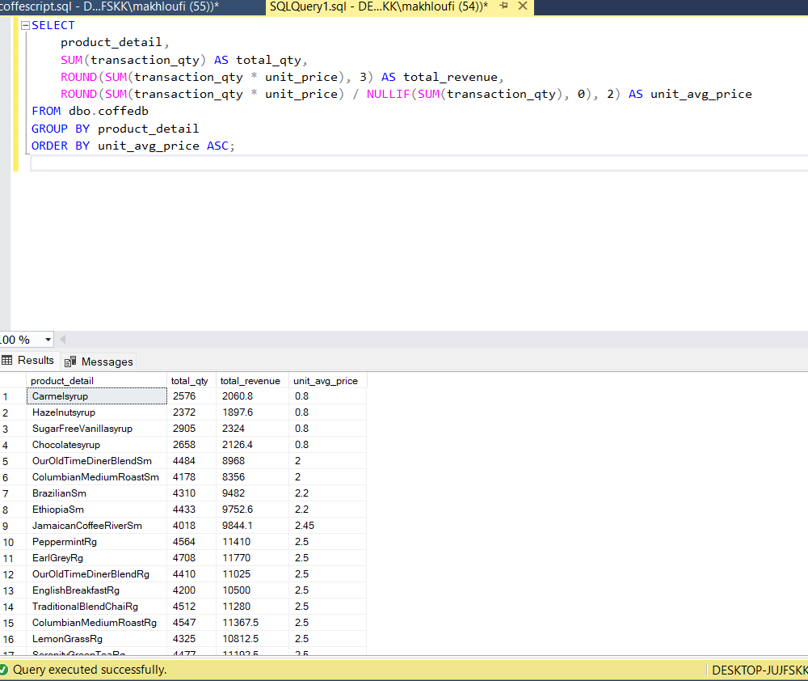

# Catégories de produits

**Résumé des observations :**
•Domination nette du café : avec près de 90k unités, le café représente près de 40% des ventes parmi ces 5 catégories. Cela confirme que le cœur du business repose sur cette catégorie.
• Tea suit en deuxième position, aussi avec un volume important mais inférieur au café.
• Bakery, Drinking Chocolate et Flavours ont des volumes bien plus faibles, avec respectivement environ 23k, 17k et 10k unités vendues. 
•Cela suggère que le coeur de l’activité commerciale tourne autour des boissons chaudes classiques (café, thé), tandis que les produits annexes ou complémentaires (pâtisseries, boissons chocolatées, arômes) ont un poids moindre.
•Cette info peut orienter des décisions marketing ou d’approvisionnement, par exemple en concentrant plus de stock sur le café et le thé. 

# Durée d’ouverture des magasins

**Résumé des observations :**
•La grande majorité des produits sont encore actifs jusqu’au 30 juin, indiquant que l’assortiment n’a pas été changé récemment.
• Certains produits (comme INeedMyBean!Dinermug) n'ont pas été vendus pendant les derniers jours → possibles produits dormants ou en fin de cycle.

# Analyse ABC (Pareto 80/20) – Analyse de la contribution produit au chiffre d’affaires
**Résumé des observations :**
Forte concentration du revenu : ~35 produits génèrent 80% du revenu.
 Produits stars à haute rotation : ce sont les "A" dans la classification ABC.
Les autres produits ("B" et "C") :
•Soit des niches à conserver pour l'image ou la fidélité client. 
•Soit des candidats à rationalisation (surtout les très faibles ventes avec faible marge).

# Ratio revenu / quantité par produit
**Résumé des observations :**
•Les sirops (Carmel, Hazelnut, Vanilla, Chocolate) ont un prix unitaire très bas autour de 0.80 $, ce qui correspond probablement à des ingrédients ou petits compléments.
•Les cafés en petites tailles (Sm, Rg) ont des prix unitaires autour de 2 à 3 $.
•Les produits pâtisseries (Scones, Biscuits) sont autour de 3 à 4.5 $.
•Les produits organiques ou premium (SustainablyGrownOrganic, DarkchocolateLg) affichent des prix unitaires plus élevés (4.5 à 7.6 $).
•Certains articles spécifiques comme tasses "INeedMyBean!" ou produits "ChiliMayan" ont des prix unitaires très élevés (12 $ à 14 $), sûrement des articles merchandising ou spécialités.

# Série quotidienne de volumes

**Résumé des observations :**
•On observe une tendance générale à la hausse entre janvier (autour de 550-600) et juin (vers 1000-1100), soit environ un doublement sur la période.
•Il y a des fluctuations journalières, mais la tendance globale est positive, signe d’une croissance soutenue.
•Cette montée peut refléter une croissance naturelle de la demande, des effets saisonniers (plus d’activité au printemps/été), ou des campagnes marketing efficaces.
•Le volume semble stable avec des pics réguliers, ce qui indique un business sain.

# Top 3 produits

**Résumé des observations :**
•Les 3 produits les plus vendus représentent moins de 7% des ventes cumulées → cela signifie une offre très diversifiée avec une distribution longue en queue.
•Aucun produit ne domine les ventes : stratégie de long tail → il serait intéressant d’analyser les produits de niche pour maximiser leur potentiel (via promotions, combos).
•Cela souligne aussi l’importance d’avoir un grand catalogue, car les ventes sont bien réparties entre les produits.

# Revenu par heure de la journée

**Résumé des observations :**

•Le pic de ventes est entre 8h et 10h du matin → cela confirme un comportement typique de consommation de café avant ou en arrivant au travail.
•7h est un tremplin (+40k de plus qu’à 6h), signe que la boutique est déjà bien active à l'ouverture.
•Les ventes diminuent graduellement après 10h, mais restent soutenues jusqu’à 17h, probablement en lien avec des pauses café ou snacks.
•Chute forte après 18h, et quasi-nulle à 20h → très peu d’activité nocturne → possibilité de fermeture avant ou faible fréquentation en soirée.

# Détail des produits

**Résumé des observations :**

•On remarque que les boissons à base de café ou thé, notamment les grands formats comme "SustainablyGrownOrganicLg" et "DarkchocolateLg", génèrent les plus gros revenus (~21k). 
•La diversité de produits (ex. cappuccino, latte, chai, scones, croissants, biscuits) montre une large gamme d’offres, avec un mix entre boissons et produits alimentaires.
•Les recettes originales (MorningSunriseChaiLg) trouvent leur public et génèrent des revenus presque comparables aux grands classiques comme le cappuccino.
•Produit “LatteRg” (Regular) dans le top 3 : montre que même le format médian est extrêmement rentable quand la demande est constante.

# Transactions en dehors des horaires typiques

**Résumé des observations :**

- 7h est un tremplin (+40k de plus qu’à 6h), signe que la boutique est déjà bien active à l'ouverture.  
- Les ventes diminuent graduellement après 10h, mais restent soutenues jusqu’à 17h, probablement en lien avec des pauses café ou snacks.  
- Chute forte après 18h, et quasi-nulle à 20h → très peu d’activité nocturne → possibilité de fermeture avant ou faible fréquentation en soirée.

**Idée stratégique :**  
Exploiter ce comportement avec des promotions matinales ou formules "before 10AM".
## Observations détaillées
- Aucune transaction après 20h n’apparaît.  
- Une forte activité avant 8h est visible dans plusieurs magasins.  
- Lower Manhattan semble avoir une clientèle matinale active (peut-être liée à des bureaux ou trajets pendulaires).  
- Astoria aussi montre des transactions dès 07:01.
## Conclusion

- Il pourrait être stratégique d’ouvrir dès 6h30–7h dans certains emplacements comme Lower Manhattan.  
- Inversement, pas besoin évident d’élargir l’horaire au-delà de 20h sauf données contraires.  
- Cela permettrait de réduire les coûts en personnel en fermant tôt et en renforçant la présence matinale.

