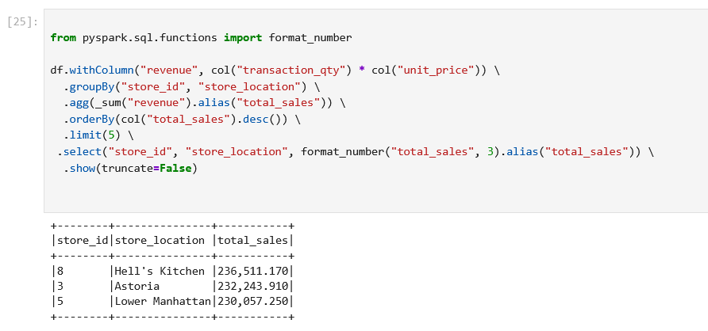
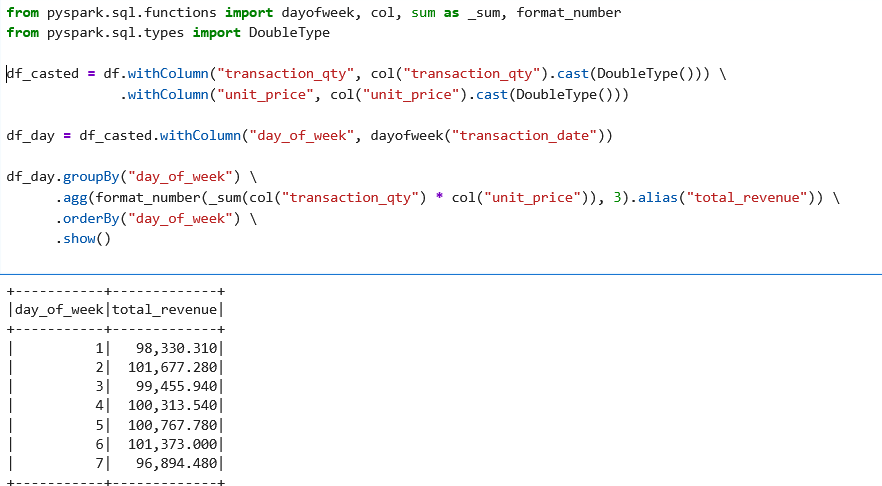

# Wöchentliche Einnahmen

**Zusammenfassung der Beobachtungen:**

Allgemeiner Trend: Es ist ein stetiges Wachstum der wöchentlichen Einnahmen zu beobachten. Der Umsatz steigt von 17.000 € in Woche 1 auf fast 38.500 € in Woche 20 – mehr als eine Verdopplung in 5 Monaten.
Stabile Anfangsphase: Zwischen Woche 1 und 6 bleiben die Verkäufe relativ konstant (~17–19K). Dies könnte auf eine Beobachtungsphase oder ein ruhiges kommerzielles Jahresanfang hinweisen.
Deutliches Wachstum:
Ab Woche 10 ist ein klarer Anstieg zu erkennen: von ~22K auf 26K, dann 29K und schließlich ein Höhepunkt bei 38.476,55 € in Woche 20.
Diese Entwicklung deutet entweder auf eine steigende Kundenzahl, einen höheren durchschnittlichen Warenkorb oder ein höheres Transaktionsvolumen hin.

 

# Durchschnittspreis pro Kategorie

**Zusammenfassung der Beobachtungen:**

Coffee beans (21,02 €) und Branded (17,72 €) sind die teuersten Kategorien – vermutlich Spezialprodukte oder solche mit hohen Einzelpreisen.
Hochvolumige, aber günstige Produkte:
Coffee, Bakery, Tea, Flavours haben niedrige Durchschnittspreise (<4 €), was auf Alltagsprodukte hindeutet.
Insbesondere Flavours (0,80 €) könnte ein Zusatz zu Hauptgetränken sein.
Einfluss auf den durchschnittlichen Warenkorb?
• Wenn Kategorien wie Coffee beans, Branded, Loose Tea selten verkauft, aber teuer sind, können sie die Wocheneinnahmen verzerren.

# Durchschnittlicher Warenkorbwert

**Zusammenfassung der Beobachtungen:**

Im Schnitt bringt jede Transaktion 4,69 € Umsatz.
Das passt zu den häufig konsumierten Kategorien (Coffee, Bakery, Tea).
Mögliche Korrelation:
Trotz teurer Produkte (Coffee beans, Branded) bleibt der Warenkorb bescheiden, was darauf hinweist:
• Diese Produkte werden selten gekauft,
• Der Großteil des Umsatzes stammt aus günstigen Artikeln.

# Top-Filialen nach Umsatz

**Zusammenfassung der Beobachtungen:**

Enges Rennen in den Top 3:
Nur 6.454 € Unterschied zwischen der besten und der drittbesten Filiale → starker interner Wettbewerb.
Diese befinden sich wahrscheinlich in stark frequentierten oder treuen Kundenzonen.

Hell's Kitchen führt:
Mögliche Gründe:
• Bessere Lage (Tourismus? Büros?),
• Bessere lokale Führung (Personal, Produktauswahl),
• Hochwertige Kundschaft, die Premium-Produkte kauft.

# Zeitliche Ansicht nach Kategorie

**Zusammenfassung der Beobachtungen:**

🥇 Coffee & Tea = Hauptsäulen
Zusammen bringen sie fast 470K € ein (über 60 % des Gesamtumsatzes) → Schlüsselprodukte.
Sollten strategisch beworben und geschützt werden (Treueprogramme, Abos, Promoaktionen).

Premiumprodukte – selten, aber lukrativ
Beispiel: Coffee beans → 1.753 Verkäufe, 40K €, ≈ 22,86 € pro Verkauf.
Ideal für High-End-Strategien:
Online-Verkauf, Kaffee-Abos, Gratisproben zur Kaufanregung.

Zweifelhaft rentable Produkte
Flavours (6,7K Verkäufe → 8,4K €), Packaged Chocolate (487 → 4,4K €) → sehr niedriger Umsatz pro Stück.
Könnten logistisch teuer und wenig gewinnbringend sein.

Strategische Empfehlungen:
• Flavours oder Chocolates in Pakete integrieren, um Warenkorbwert zu erhöhen.
• Schwach drehende Produkte neu bewerten oder aus dem Sortiment nehmen.

# Multiple lineare Regression

**Zusammenfassung der Beobachtungen:**

Verwendbar für Vorhersagen und Business-Simulationen.
Zuverlässiges, realitätsnahes Modell.
Label ≈ Vorhersage: Ergebnisse sehr nah beieinander, geringe Fehler.
Beispiel: Für [2, 3.1] → 6,2 € real vs. 6,314 € vorhergesagt.

# Analyse der Verkäufe pro Wochentag

**Zusammenfassung der Beobachtungen:**

Umsatzstärkste Tage:
Freitag (6) und Montag (2) → Top-Performance. Mögliche Gründe:
• Wochenendangebote starten am Freitag,
• Wochenstart-Effekt am Montag.

Schwächster Tag: Samstag (7)
Hypothese:
• Kunden kaufen bereits freitags ein?
• Weniger Stadtbesuche?
• Möglicherweise geänderte Öffnungszeiten?

Moderate, aber relevante Unterschiede
• Unterschied von ≈ 4.478 € zwischen stärkstem (Fr) und schwächstem (Sa) Tag.
Strategische Empfehlungen:
• Samstag gezielt stärken mit exklusiven Angeboten.
• Personalressourcen und Lagerhaltung anpassen.
• Produkt- und standortspezifische Analyse für lokale Insights.

# Zeitreihenanalyse

**Zusammenfassung der Beobachtungen:**

• Umsatz steigt im Wochenverlauf mit wenigen Rückgängen.
• Höchststand in Woche 20 bei 38.476,55 €, stetiges Wachstum seit Woche 14.
Wichtige Zeiträume:
Woche 14 → 15 → 16 → 18 → 20 → starkes Wachstum.
Woche 4 → 5 oder 16 → 17 → vorübergehende Rückgänge.
Produkte mit starkem Wachstum:
• Produkt-ID 1: +1200 % Wachstum in Woche 10.
• Produkt-ID 11: +200 % zwischen Woche 2 und 3.
Mögliche Gründe:
• Promotionsstart,
• Wiederverfügbarkeit,
• Effektives Targeting.
• Häufige Peaks:
• Produkte 1 und 10 haben mehrere >200 % Anstiege → schnelle Erfolgskandidaten.

# Korrelationsmatrix

**Zusammenfassung der Beobachtungen:**

unit_price ↔ revenue: starke Korrelation (0,686)
→ Höherer Preis führt zu höherem Umsatz – logisch.

transaction_qty ↔ revenue: moderate Korrelation (0,356)
→ Mehr Verkäufe führen zu mehr Umsatz, aber mit begrenztem Effekt.
→ Günstige Produkte mit hohem Volumen bringen nicht so viel wie wenige Premiumverkäufe.

transaction_qty ↔ unit_price: negative Korrelation (-0,124)
→ Höherer Preis → geringere Stückzahlen – klassisches Muster.
Strategien:
• Pricing optimieren – Preiserhöhungen könnten nur geringen Einfluss auf Menge haben.
• Bundle-Angebote für wenig korrelierte Produkte.

 

# RFM-Segmentierung

**Zusammenfassung der Beobachtungen:**

Recency = 736 Tage
→ Alle Filialen (3, 5, 8) haben seit über 2 Jahren keine Verkäufe mehr getätigt.
→ Entweder enden die Daten vor 2 Jahren oder die Läden sind inaktiv.
Frequency = Transaktionsanzahl
• Filiale 8 am höchsten (50.735), dann 3 (50.599), dann 5 (47.782).
→ Kaum Unterschiede → ähnliches Volumen.
Monetary = Gesamtumsatz
• Alle drei um 230K–236K → ähnliche Betriebsgröße/Aktivität, aber unterschiedlichen Clustern zugeordnet.

 

