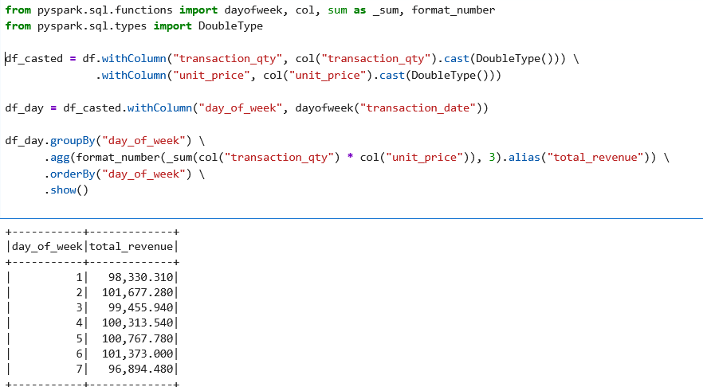

# Weekly Revenue
**Summary of Observations: :**

Overall Trend: A steady growth in weekly revenue is observed. Revenue increases from 17K in week 1 to nearly 38.5K in week 20, more than doubling over the course of 5 months.

Initial Stability: From week 1 to 6, sales remain relatively stable (~17K to 19K). This may correspond to an observation period or a commercially quiet start to the year.

Significant Growth:
Starting from week 10, there is a clear acceleration: from ~22K to 26K, then 29K, and finally a peak at 38,476.55 in week 20.
This trend suggests either an increase in customer traffic, a higher average basket size, or a rise in transaction volume.

 

# Average Price by Category 
**Summary of Observations:**
Coffee beans (€21.02) and Branded (€17.72) are the most expensive categories, likely due to being specialty products or sold in large quantities/high unit prices.

High-volume but low-price products:
Coffee, Bakery, Tea, and Flavours have a low average price (<€4), suggesting they are everyday consumer items.
In particular, Flavours (€0.80) may be an add-on to main beverages.

Impact on average basket?
• If categories like Coffee beans, Branded, and Loose Tea are sold infrequently but are very expensive, they may artificially inflate weekly revenue.

# Average Basket Value
**Summary of Observations:**
On average, each individual transaction generates €4.69 in revenue.
This aligns with the average prices of the most frequently consumed categories (Coffee, Bakery, Tea).

Possible correlation:
Despite the presence of high-priced items (Coffee beans, Branded), the basket value remains modest, suggesting that:
• They are sold infrequently,
• Sales volume is concentrated on low-priced products.

 # Top Stores by Revenue
**Summary of Observations:**
Tight race among the top 3
There is a very small gap between the top three stores: only €6,454 separates the 1st and 3rd.
This indicates intense internal competition.
These stores are likely located in high-traffic areas or have a loyal customer base.

Hell's Kitchen leads
This could be due to:
• A better location (tourist area? business district?),
• More effective local management (staff, product offering),
• Or a high-end clientele purchasing more premium products.

# Temporary View by Category
**Summary of Observations:**
 Coffee & Tea = Core Products
Together, they generate nearly €470K, accounting for over 60% of total revenue.
This makes them key driver products.
They should be protected, enhanced, and strategically leveraged (loyalty programs, subscriptions, promotional campaigns).

Premium products: low volume, high profitability
Example: Coffee beans → 1,753 sales but €40K revenue, i.e., ≈ €22.86 per sale.
Ideal for upscale strategies:
online sales, coffee subscriptions, free samples to encourage purchase.

Products with questionable profitability
Flavours (6.7K sales → €8.4K) and Packaged Chocolate (487 sales → €4.4K) → very low average revenue.
They risk being costly to manage (logistics, storage) for minimal margin.

Strategic suggestions:
Create bundles with Flavours or Chocolates to increase basket value.
Remove or reprice low-turnover, low-revenue products.

# Multiple Linear Regression
**Summary of Observations:**
Used for business prediction and simulation.

Reliable and realistic model
Label ≈ Prediction: the results are very close, with negligible error.
Example: for [2, 3.1], the actual value is €6.20 vs predicted €6.314.

# Sales Analysis by Day of the Week
**Summary of Observations:**
    Most profitable days:
    Friday (6) and Monday (2) → Best performance. Possibly due to:
    • Weekend offers starting on Friday,
    • A post-weekend boost on Monday (recovery effect?).

    Lowest day: Saturday (7)
    Hypotheses:
    • Customers stock up on Friday?
    • Less foot traffic in the city?
    • Possibly adjusted store hours?

    Moderate but meaningful differences
    • Approx. €4,478 gap between the best (Friday) and worst (Saturday) day.

Strategic recommendations:
• Boost Saturday sales:
• Exclusive promotions to compensate for lower performance.
• Optimize human resources:
• Reduce staff or reallocate stock based on daily patterns.
• Analyze by product & store to understand local customer behavior.

# Time Series
**Summary of Observations:**
• Revenue increases over the weeks, with some temporary dips.
• Peak at week 20 with €38,476.55, representing steady growth since week 14.

Key periods to monitor:
Week 14 → 15 → 16 → 18 → 20: strong growth.
Week 4 → 5 or 16 → 17: slight temporary declines.

High-growth products:
• product_id = 1 shows an exceptional peak in week 10 with a +1200% increase.
• product_id = 11 grows by +200% between week 2 and week 3.
These extreme increases may be explained by:
• Launch of promotions,
• Sudden availability (after stockouts?),
• Effective marketing targeting.

Peak frequency:
Products 1 and 10 show multiple increases >200% → potential quick-sellers.

# Correlation Matrix
**Summary of Observations:**
    unit_price ↔ revenue: strong correlation (0.686)
    The higher the price, the more revenue is generated — logical and expected.

    transaction_qty ↔ revenue: moderate correlation (0.356)
    Selling in quantity increases revenue, but with a limited effect.
    This reflects that low-priced items may sell in large volumes but don’t generate as much revenue as a few premium sales.

    transaction_qty ↔ unit_price: negative correlation (-0.124)
    The higher the price, the fewer units are sold — a common trend.
    This highlights a volume vs. margin strategy.

Use Case:
For pricing strategies:
• Confirm that price increases have little effect on quantity sold (low price elasticity).
• Confirm the value of bundle offers, especially for products with low inter-correlation.

 

# RFM Segmentation
**Summary of Observations:**
Recency = 736 days
This means that all three stores (3, 5, 8) have not made any sales for over 2 years (~730 days = 2 years).
Either the sales data stops two years ago, or these stores have been inactive recently.

Frequency: number of transactions
• Store 8 has the highest frequency (50,735), followed by store 3 (50,599), then store 5 (47,782).
• The differences are small → similar behavior in terms of transaction volume.

Monetary: total revenue
• All stores have very similar revenue (~€230K to €236K).
This suggests these 3 stores are similar in size/activity, but are assigned to different clusters.

 

