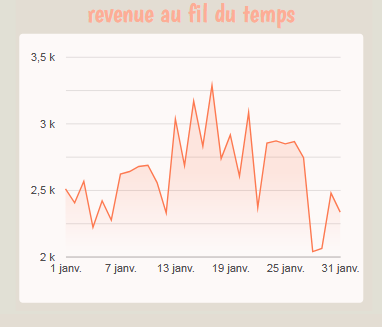

# Diagramm: Einnahmen im Zeitverlauf

Die Kurve zeigt die tägliche Entwicklung der Einnahmen.

Ein deutlicher Anstieg ist gegen Ende der ersten Woche zu beobachten (z. B. ein Peak um den 7.–9. Januar), möglicherweise durch ein Event oder ein Angebot.

Es gibt auch Tage mit schwacher Performance (z. B. 13. und 25. Januar).

Das Datum kann über den Filter angepasst werden.

# Diagramm: Verkäufe nach Produkt

Top-Produkte nach Umsatz:

Latte Rg

Latte

Cappuccino

Brazilian Coffee

Sustainable Coffee

→ Alles Kaffeespezialitäten, zeigt starke Vorliebe für traditionelle und Gourmet-Kaffees.
Andere wie Dark Chocolate und Morning Tea haben geringeren Umsatz.

# Diagramm: Umsatzverteilung nach Kategorie

Kaffee ist das Herzstück des Geschäfts.

Bakery und Chocolate: sehr gut für Cross-Selling.

Beans = Nische für Stammkunden oder Experten.

# Tabelle: Produkt-Performance

Barista Espresso: Sehr beliebt, hoher Umsatz → Schlüsselprodukt

Brewed Teas: Hohes Volumen, niedriger Preis → Lockprodukt oder Beilage

Biscotti: Weniger verkauft, aber gute Marge → in Kombos pushen

Black / Chai Tea: Sehr geringe Verkäufe, aber hoher Preis → Premium-Nische?

Clothing: Geringes Volumen, hoher Preis → Merchandise neu positionieren

# Diagramm: Einnahmen nach Uhrzeit

Höchste Einnahmezeit: 11:18:31 → ca. 1.500 €

Danach: 09:55:47 (~1.200 €), 09:05:20 (~800 €)

Danach starker Rückgang (250–400 €)

Fokus liegt klar auf dem Vormittag (9–11:30 Uhr)

Nachmittags kaum rentabel → z. B. 15:38, 19:24 fast null

# Diagramm: Umsatzvergleich zwischen Standorten

Drei Filialen haben nahezu identischen Umsatz

Hell’s Kitchen leicht führend

→ zeigt homogene Strategie

# Diagramm: Verkaufsvolumen pro Monat

Kontinuierliches Wachstum von Februar bis Juni

Juni = Rekordmonat

Januar/Februar = schwächste Monate → wahrscheinlich Nebensaison

# Verfügbare Filter

product_type: Entwicklung eines Produkts

product_category: nach Produktfamilien (Kaffee, Tee …)

store_location: Leistung nach Standort

date_range: hier vom 1. bis 31. Januar

#Wichtige Kennzahlen (KPI)

Umsatz: 81.700 € → sehr guter Monatswert

Durchschnittlicher Warenkorb: 4,72 € pro Transaktion

Einzigartige Produkte: 80 → große Angebotsvielfalt

.png)

