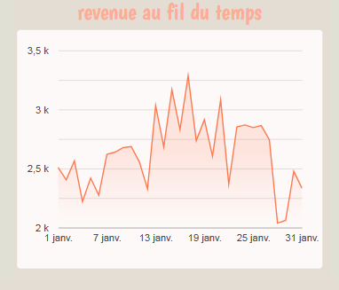
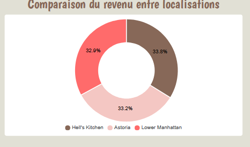

# Graphique : Revenu au fil du temps

•La courbe montre l'évolution journalière des revenus.
•On observe une hausse notable vers la fin de la première semaine (ex. pic autour du 7-9 janvier), ce qui peut coïncider avec un événement ou une offre.
•Des jours à faible performance existent aussi (ex. 13 et 25 janvier).
•on peut changer la date par le filtre 

# Graphique : Ventes par produit

Les tops produits en termes de revenue sont :

•Latte Rg
•Latte
•Cappuccino
•Brazilian Coffee
•Sustainable Coffee

Ces produits sont tous à base de café, ce qui reflète une forte préférence pour les cafés traditionnels et gourmets.

D’autres produits comme Dark Chocolate et Morning Tea apparaissent également, mais avec un revenu moindre.

# Graphique : Répartition des revenus par catégorie

•Le café est le cœur du business
•Bakery et Chocolate : très bons en cross-sell
•Beans = niche pour clients fidèles ou prosopulaire

# Tableau Performance des produit

•Barista Espresso: Très populaire, revenu élevé → produit clé
•Brewed Teas:Fort volume, prix bas → produits d’appel ou accompagnement
•Biscotti: Moins vendu mais bonne marge → à pousser en combo
•Black / Chai Tea: Très peu vendus, mais prix élevés → niche premium ?
•Clothing: Faible volume, prix élevé → produits dérivés à repositionner

 # Graphique : Revenu généré par heure de la journée

• Lecture des résultats  :
•Heure la plus rentable : 11:18:31 → environ 1 500 €
•Suivie de : 09:55:47 (~1 200 €), 09:05:20 (~800 €)
•Les heures suivantes ont un revenu beaucoup plus faible (entre 250 € et 400 €)
•Analyse :
•Les pics de ventes se concentrent en matinée, notamment entre 9h et 11h30
•Cela montre une forte affluence pour les petits-déjeuners ou pauses café du matin
•Les créneaux après 12h semblent très peu rentables (ex. 15:38, 19:24 → très bas)

# Graphique : Comparaison du revenu entre localisations
 
•Les 3 magasins ont une répartition quasi identique du chiffre d’affaires
•Hell’s Kitchen est légèrement en tête
•Cet équilibre suggère une stratégie homogène entre les sites

# Graphique : Volume de ventes par mois
 

•Croissance continue des ventes de février à juin (quasi linéaire)
•Juin est le mois record en termes de volume
•Janvier et février ont les volumes les plus faibles → probablement saison basse

# Filtres disponibles

product_type : pour voir l'évolution d’un seul produit

product_category : pour filtrer par grandes familles (Coffee, Tea…)

store_location : pour segmenter les performances par magasin

date_range : ici fixé entre le 1 et le 31 janvier

# Indicateurs clés (KPI)

Revenue: 81,700 :Très bon chiffre mensuel. Représente une base solide.

Panier moyen: 4.72 : Revenu moyen par transaction

Produits uniques: 80 : Diversité de l’offre 
.png)
